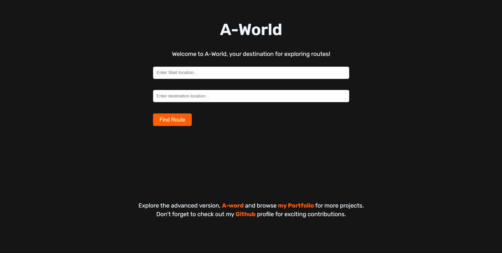

# AWS DevOps Using CI/CD
### Overview
🚀🛠️ AWS DevOps practices involve the integration of development and operations teams to streamline the software delivery process. Continuous Integration and Continuous Deployment (CI/CD) pipelines automate the building, testing, and deployment of applications, ensuring rapid and reliable delivery of software updates.

Check out the live preview of our hosted [Website](http://your-website-url.com)

### Resources

- [AWS CodePipeline Documentation](https://docs.aws.amazon.com/codepipeline)
- [AWS CodeBuild Documentation](https://docs.aws.amazon.com/codebuild)
- [AWS CodeDeploy Documentation](https://docs.aws.amazon.com/codedeploy)
- [Amazon EC2 Documentation](https://docs.aws.amazon.com/ec2)
- [Amazon S3 Documentation](https://docs.aws.amazon.com/s3)

### Workflow

***Code Commit***: Developers commit code changes to the version control repository.

***Code Build***: Code changes trigger automated builds using AWS CodeBuild, compiling code and running unit tests.

***Code Review***: Automated code reviews and quality checks are performed.

***Deployment***: Approved changes are automatically deployed to staging environments using AWS CodeDeploy.

***Testing***: Automated tests, including integration and end-to-end tests, are executed in the staging environment.

***Approval***: Manual approval is required before changes are deployed to production.

***Production Deployment***: Approved changes are deployed to the production environment using AWS CodeDeploy.

### Contact

For inquiries or feedback, please contact **[Harsha G](mailto:harshag3106@gmail.com)**.

### Contributing
🔩📝 Contributions are encouraged! There are various ways you can contribute to this project:

- ***Report an Issue***: Encountered a bug or have an idea for an improvement? Open an issue to discuss it.
- ***Submit a Pull Request***: Have code changes you'd like to propose? Submit a pull request for review.
- ***Offer Feedback***: Not a coder? No problem! Your feedback on usability and features is invaluable.
  
Let's collaborate to enhance this project together!
